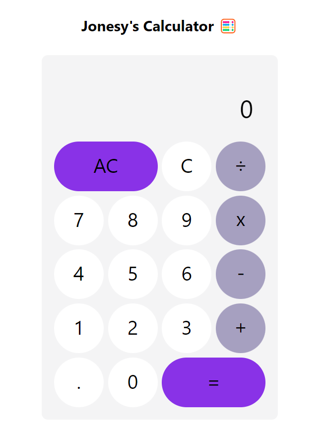

<h1>
Calculator 🧮
</h1>

---

### App Info

This is a calculator app that was made to practice using React and the useReducer hook.

This app can be used to do quick math, and by my calculations, that's not a bad thing 🤪

> Deployed here: https://oj-react-calculator.netlify.app/

---
